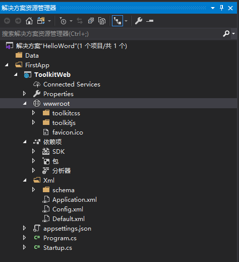
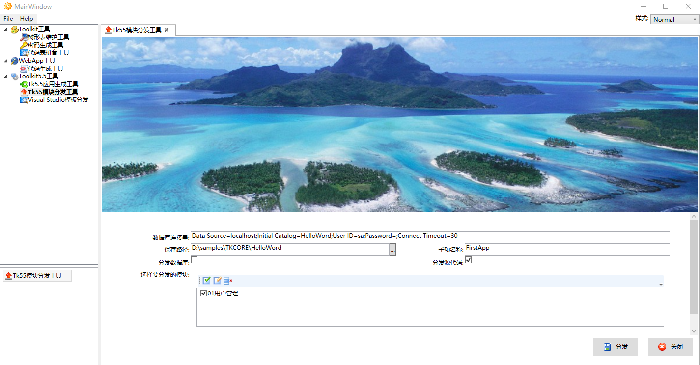
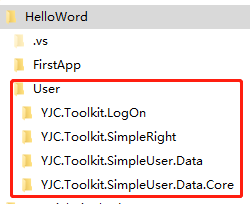
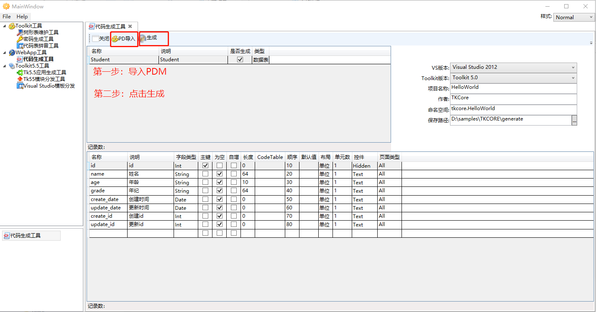
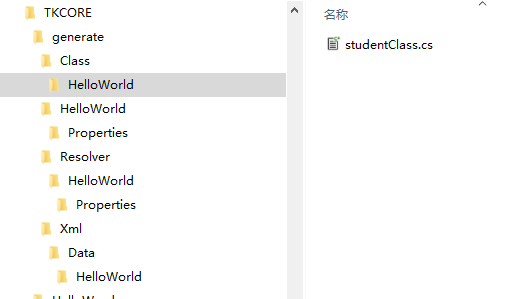
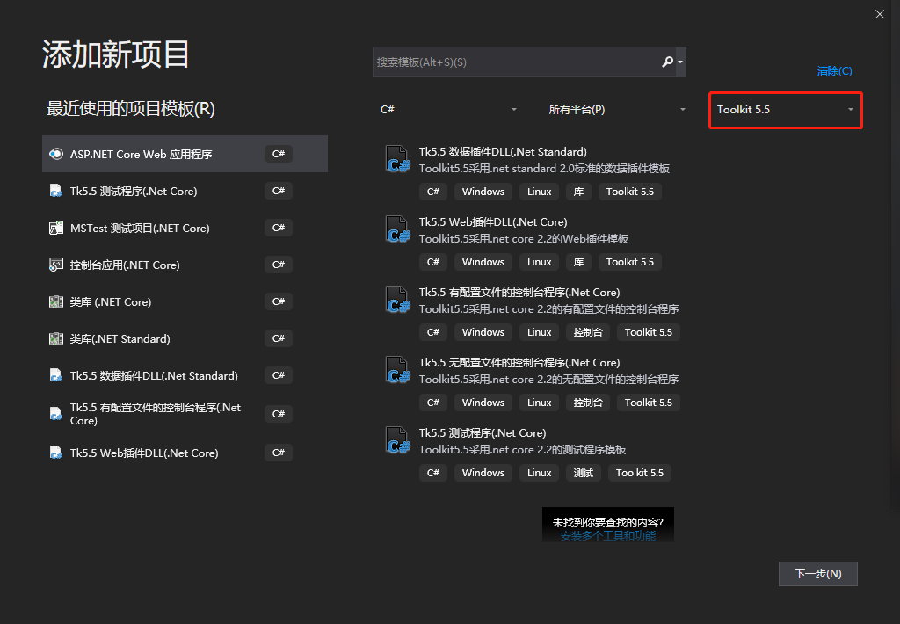

# ToolkitSuite

## 概要

ToolkitSuite是TKCore官方提供的、旨在提高开发效率的一套辅助软件。常用的功能有应用生成工具、模块分发工具、代码生成工具。

## 应用生成工具

快速创建TKCore Web应用的一款工具，不用一一引用DLL、不用一一创建框架固有的文件夹，一键生成！

- 配置如下：

::: tip
勾选了“是否生成数据库”的场合，数据库连接字符串必须设置正确
:::

- 生成后的Web应用目录结构如下：

## 模块分发工具

模块分发可以添加通用的模块到应用。

- 配置如下：

::: tip
勾选了“分发数据库”的场合，数据库连接字符串必须设置正确
:::

- 分发后Web应用目录结构如下：

## 代码生成工具

- 配置如下：

  

::: 注意 这里Toolkit版本必须选择“Toolkit5.0”，预定今后优化 
:::

- 生成后，效果如下：

  

## Visual Studio模板分发

- 配置如下：

- 分发后效果如下：

  

- 添加新项目能看到以下内容，说明分发成功：

  

::: tip
与应用生成工具创建的应用一致，建议使用这种方式创建应用
:::

## 官网地址

- [www.tkcore.net](www.tkcore.net)
